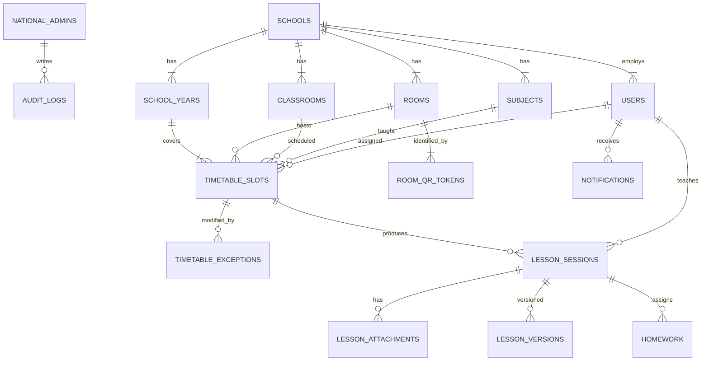

# Schéma de base de données — eCahier

SGBD : **PostgreSQL 16**. Conventions : `snake_case`, UUID v7 en PK, `created_at` / `updated_at`, `deleted_at` pour soft delete, `school_id` pour multi-tenant.

---

## 1. Diagramme entité-relation (vue d’ensemble)



---

## 2. Tables

### 2.1 Référentiel national & établissements

```sql
CREATE TABLE schools (
  id              UUID PRIMARY KEY,
  code            VARCHAR(32) UNIQUE NOT NULL,      -- ex. EST-LBV-001
  name            VARCHAR(255) NOT NULL,
  city            VARCHAR(120),
  province        VARCHAR(120),
  timezone        VARCHAR(64) NOT NULL DEFAULT 'Africa/Libreville',
  status          VARCHAR(20) NOT NULL DEFAULT 'active', -- active|suspended
  created_at      TIMESTAMPTZ NOT NULL DEFAULT now(),
  updated_at      TIMESTAMPTZ NOT NULL DEFAULT now()
);

CREATE TABLE school_years (
  id              UUID PRIMARY KEY,
  school_id       UUID NOT NULL REFERENCES schools(id),
  label           VARCHAR(32) NOT NULL,              -- "2025-2026"
  starts_on       DATE NOT NULL,
  ends_on         DATE NOT NULL,
  is_current      BOOLEAN NOT NULL DEFAULT false,
  UNIQUE (school_id, label)
);
```

### 2.2 Utilisateurs & rôles

```sql
CREATE TYPE user_role AS ENUM (
  'national_admin',
  'school_admin',
  'teacher'
);

CREATE TABLE users (
  id              UUID PRIMARY KEY,
  school_id       UUID REFERENCES schools(id),       -- NULL pour national_admin
  role            user_role NOT NULL,
  email           VARCHAR(255),
  phone           VARCHAR(32),
  first_name      VARCHAR(120) NOT NULL,
  last_name       VARCHAR(120) NOT NULL,
  password_hash   TEXT,                              -- admin uniquement
  pin_hash        TEXT,                              -- enseignants (+ admin optionnel)
  pin_failed_attempts INT NOT NULL DEFAULT 0,
  pin_locked_until TIMESTAMPTZ,
  is_active       BOOLEAN NOT NULL DEFAULT true,
  last_login_at   TIMESTAMPTZ,
  created_at      TIMESTAMPTZ NOT NULL DEFAULT now(),
  updated_at      TIMESTAMPTZ NOT NULL DEFAULT now(),
  deleted_at      TIMESTAMPTZ,
  UNIQUE (school_id, email),
  CHECK (
    (role = 'national_admin' AND school_id IS NULL)
    OR (role <> 'national_admin' AND school_id IS NOT NULL)
  )
);

CREATE INDEX idx_users_school_role ON users(school_id, role) WHERE deleted_at IS NULL;
```

### 2.3 Classes, salles, matières

```sql
CREATE TABLE classrooms (
  id              UUID PRIMARY KEY,
  school_id       UUID NOT NULL REFERENCES schools(id),
  school_year_id  UUID NOT NULL REFERENCES school_years(id),
  name            VARCHAR(64) NOT NULL,              -- "3ème A"
  level           VARCHAR(64),                       -- "3ème"
  created_at      TIMESTAMPTZ NOT NULL DEFAULT now(),
  deleted_at      TIMESTAMPTZ,
  UNIQUE (school_id, school_year_id, name)
);

CREATE TABLE rooms (
  id              UUID PRIMARY KEY,
  school_id       UUID NOT NULL REFERENCES schools(id),
  code            VARCHAR(32) NOT NULL,              -- "B12"
  label           VARCHAR(120) NOT NULL,             -- "Salle B12"
  building        VARCHAR(64),
  capacity        INT,
  public_id       VARCHAR(32) UNIQUE NOT NULL,       -- opaque QR payload
  is_active       BOOLEAN NOT NULL DEFAULT true,
  created_at      TIMESTAMPTZ NOT NULL DEFAULT now(),
  deleted_at      TIMESTAMPTZ,
  UNIQUE (school_id, code)
);

-- Historique de rotation des secrets QR (affichage physique peut rester stable via public_id)
CREATE TABLE room_qr_tokens (
  id              UUID PRIMARY KEY,
  room_id         UUID NOT NULL REFERENCES rooms(id),
  token_hash      TEXT NOT NULL,                     -- hash du secret signé
  valid_from      TIMESTAMPTZ NOT NULL DEFAULT now(),
  valid_to        TIMESTAMPTZ,
  created_by      UUID REFERENCES users(id)
);

CREATE TABLE subjects (
  id              UUID PRIMARY KEY,
  school_id       UUID NOT NULL REFERENCES schools(id),
  code            VARCHAR(32) NOT NULL,
  name            VARCHAR(120) NOT NULL,
  UNIQUE (school_id, code)
);
```

### 2.4 Emploi du temps

```sql
CREATE TYPE weekday AS ENUM ('mon','tue','wed','thu','fri','sat','sun');

CREATE TABLE timetable_slots (
  id              UUID PRIMARY KEY,
  school_id       UUID NOT NULL REFERENCES schools(id),
  school_year_id  UUID NOT NULL REFERENCES school_years(id),
  room_id         UUID NOT NULL REFERENCES rooms(id),
  classroom_id    UUID NOT NULL REFERENCES classrooms(id),
  subject_id      UUID NOT NULL REFERENCES subjects(id),
  teacher_id      UUID NOT NULL REFERENCES users(id),
  weekday         weekday NOT NULL,
  starts_at       TIME NOT NULL,                     -- heure locale école
  ends_at         TIME NOT NULL,
  effective_from  DATE NOT NULL,
  effective_to    DATE,                              -- NULL = ouvert
  created_at      TIMESTAMPTZ NOT NULL DEFAULT now(),
  deleted_at      TIMESTAMPTZ,
  CHECK (ends_at > starts_at)
);

CREATE INDEX idx_slots_room_day ON timetable_slots(room_id, weekday, starts_at)
  WHERE deleted_at IS NULL;

CREATE TYPE exception_kind AS ENUM (
  'cancellation',
  'replacement',      -- autre enseignant
  'swap',             -- permutation
  'room_change',
  'time_change',
  'authorization'     -- enseignant non prévu autorisé
);

CREATE TABLE timetable_exceptions (
  id              UUID PRIMARY KEY,
  school_id       UUID NOT NULL REFERENCES schools(id),
  slot_id         UUID NOT NULL REFERENCES timetable_slots(id),
  kind            exception_kind NOT NULL,
  on_date         DATE NOT NULL,
  substitute_teacher_id UUID REFERENCES users(id),
  new_room_id     UUID REFERENCES rooms(id),
  new_starts_at   TIME,
  new_ends_at     TIME,
  swap_with_slot_id UUID REFERENCES timetable_slots(id),
  reason          TEXT,
  authorized_by   UUID NOT NULL REFERENCES users(id),
  created_at      TIMESTAMPTZ NOT NULL DEFAULT now()
);

CREATE UNIQUE INDEX uq_exception_slot_date ON timetable_exceptions(slot_id, on_date, kind);
```

### 2.5 Séances (cahier de textes)

```sql
CREATE TYPE session_status AS ENUM (
  'draft',
  'validated',
  'locked'            -- figé après export officiel / clôture période
);

CREATE TABLE lesson_sessions (
  id              UUID PRIMARY KEY,
  school_id       UUID NOT NULL REFERENCES schools(id),
  school_year_id  UUID NOT NULL REFERENCES school_years(id),
  room_id         UUID NOT NULL REFERENCES rooms(id),
  classroom_id    UUID NOT NULL REFERENCES classrooms(id),
  subject_id      UUID NOT NULL REFERENCES subjects(id),
  teacher_id      UUID NOT NULL REFERENCES users(id),
  slot_id         UUID REFERENCES timetable_slots(id),
  session_date    DATE NOT NULL,
  starts_at       TIMESTAMPTZ NOT NULL,
  ends_at         TIMESTAMPTZ NOT NULL,
  title           VARCHAR(255) NOT NULL DEFAULT '',
  content         TEXT NOT NULL DEFAULT '',
  competencies    JSONB NOT NULL DEFAULT '[]',
  exercises       TEXT NOT NULL DEFAULT '',
  homework_text   TEXT NOT NULL DEFAULT '',
  homework_due_on DATE,
  observations    TEXT NOT NULL DEFAULT '',
  status          session_status NOT NULL DEFAULT 'draft',
  signature_hash  TEXT,                              -- hash PIN + payload au moment validation
  validated_at    TIMESTAMPTZ,
  client_mutation_id UUID UNIQUE,                    -- idempotence offline
  created_at      TIMESTAMPTZ NOT NULL DEFAULT now(),
  updated_at      TIMESTAMPTZ NOT NULL DEFAULT now(),
  deleted_at      TIMESTAMPTZ
);

CREATE INDEX idx_sessions_teacher_date ON lesson_sessions(teacher_id, session_date DESC)
  WHERE deleted_at IS NULL;
CREATE INDEX idx_sessions_classroom_date ON lesson_sessions(classroom_id, session_date DESC)
  WHERE deleted_at IS NULL;
CREATE INDEX idx_sessions_search ON lesson_sessions
  USING GIN (to_tsvector('french', coalesce(title,'') || ' ' || coalesce(content,'') || ' ' || coalesce(homework_text,'')));

CREATE TABLE lesson_versions (
  id              UUID PRIMARY KEY,
  session_id      UUID NOT NULL REFERENCES lesson_sessions(id),
  version_no      INT NOT NULL,
  snapshot        JSONB NOT NULL,                    -- copie complète des champs métier
  changed_by      UUID NOT NULL REFERENCES users(id),
  changed_at      TIMESTAMPTZ NOT NULL DEFAULT now(),
  UNIQUE (session_id, version_no)
);

CREATE TABLE lesson_attachments (
  id              UUID PRIMARY KEY,
  session_id      UUID NOT NULL REFERENCES lesson_sessions(id),
  school_id       UUID NOT NULL REFERENCES schools(id),
  file_key        TEXT NOT NULL,
  file_name       VARCHAR(255) NOT NULL,
  mime_type       VARCHAR(120) NOT NULL,
  size_bytes      BIGINT NOT NULL,
  uploaded_by     UUID NOT NULL REFERENCES users(id),
  created_at      TIMESTAMPTZ NOT NULL DEFAULT now(),
  deleted_at      TIMESTAMPTZ
);

CREATE TABLE homework (
  id              UUID PRIMARY KEY,
  session_id      UUID NOT NULL REFERENCES lesson_sessions(id),
  school_id       UUID NOT NULL REFERENCES schools(id),
  classroom_id    UUID NOT NULL REFERENCES classrooms(id),
  subject_id      UUID NOT NULL REFERENCES subjects(id),
  teacher_id      UUID NOT NULL REFERENCES users(id),
  title           VARCHAR(255) NOT NULL,
  description     TEXT NOT NULL DEFAULT '',
  given_on        DATE NOT NULL,
  due_on          DATE,
  created_at      TIMESTAMPTZ NOT NULL DEFAULT now(),
  deleted_at      TIMESTAMPTZ
);
```

### 2.6 Notifications, recherche, audit, exports

```sql
CREATE TYPE notification_kind AS ENUM (
  'missing_session',
  'homework_due',
  'reminder',
  'timetable_change'
);

CREATE TABLE notifications (
  id              UUID PRIMARY KEY,
  school_id       UUID NOT NULL REFERENCES schools(id),
  user_id         UUID NOT NULL REFERENCES users(id),
  kind            notification_kind NOT NULL,
  title           VARCHAR(255) NOT NULL,
  body            TEXT NOT NULL,
  payload         JSONB NOT NULL DEFAULT '{}',
  read_at         TIMESTAMPTZ,
  created_at      TIMESTAMPTZ NOT NULL DEFAULT now()
);

CREATE TABLE audit_logs (
  id              UUID PRIMARY KEY,
  school_id       UUID,                              -- NULL si action nationale
  actor_id        UUID REFERENCES users(id),
  action          VARCHAR(64) NOT NULL,              -- session.validate, pin.fail…
  entity_type     VARCHAR(64) NOT NULL,
  entity_id       UUID,
  ip              INET,
  user_agent      TEXT,
  meta            JSONB NOT NULL DEFAULT '{}',
  created_at      TIMESTAMPTZ NOT NULL DEFAULT now()
);

CREATE INDEX idx_audit_school_time ON audit_logs(school_id, created_at DESC);

CREATE TABLE export_jobs (
  id              UUID PRIMARY KEY,
  school_id       UUID NOT NULL REFERENCES schools(id),
  requested_by    UUID NOT NULL REFERENCES users(id),
  format          VARCHAR(16) NOT NULL,              -- pdf|xlsx
  scope           JSONB NOT NULL,                    -- { classroomId, from, to }
  status          VARCHAR(20) NOT NULL DEFAULT 'pending',
  file_key        TEXT,
  error           TEXT,
  created_at      TIMESTAMPTZ NOT NULL DEFAULT now(),
  finished_at     TIMESTAMPTZ
);
```

---

## 3. Règles d’intégrité métier (à encoder côté API + DB)

1. Une séance `validated` ne peut être soft-deleted que par `school_admin` avec motif audité.
2. Un enseignant ne lit / écrit que ses propres séances (sauf admin).
3. Remplacement : `timetable_exceptions.substitute_teacher_id` doit être autorisé pour valider le PIN sur ce créneau.
4. Tolérance horaire configurable par école (`schools.settings` JSONB optionnel, phase 2).
5. `client_mutation_id` unique empêche le double-post offline.

---

## 4. Vues utiles

```sql
CREATE VIEW v_missing_sessions_today AS
SELECT s.school_id, s.id AS slot_id, s.teacher_id, s.classroom_id, s.subject_id, s.room_id
FROM timetable_slots s
JOIN school_years sy ON sy.id = s.school_year_id AND sy.is_current
WHERE s.deleted_at IS NULL
  AND s.weekday = LOWER(TO_CHAR(now() AT TIME ZONE 'Africa/Libreville', 'dy'))::weekday -- adapter mapping
  AND NOT EXISTS (
    SELECT 1 FROM lesson_sessions ls
    WHERE ls.slot_id = s.id
      AND ls.session_date = (now() AT TIME ZONE 'Africa/Libreville')::date
      AND ls.deleted_at IS NULL
      AND ls.status IN ('draft','validated','locked')
  );
```

*(Le mapping weekday sera implémenté proprement en SQL/application.)*

---

## 5. Volumétrie estimée (ordre de grandeur)

Hypothèse nationale progressive : 200 établissements, 40 enseignants/école, 6 séances/jour/enseignant, 180 jours/an.

- Séances/an ≈ 200 × 40 × 6 × 180 ≈ **8,6 M** lignes
- Index + versions (+20 %) → planifier partitioning par `session_date` (année scolaire) dès > 5 M lignes
