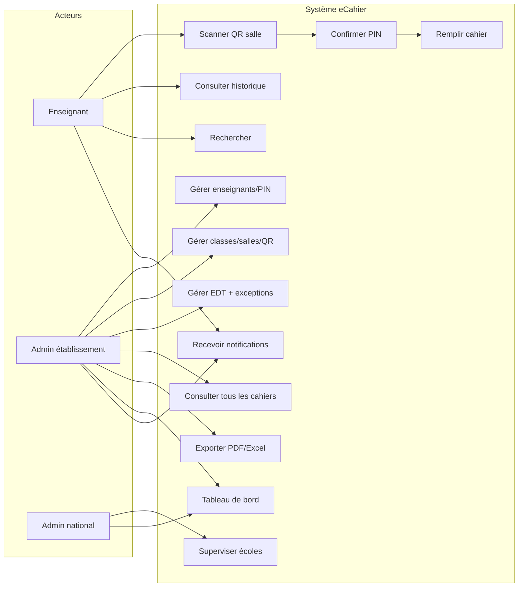
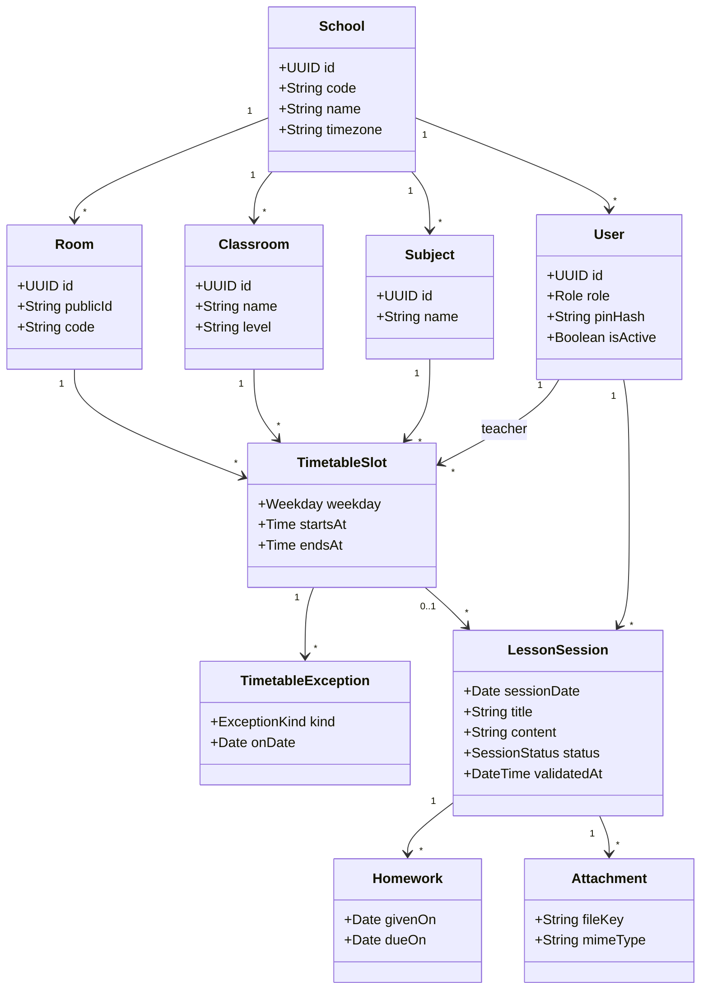
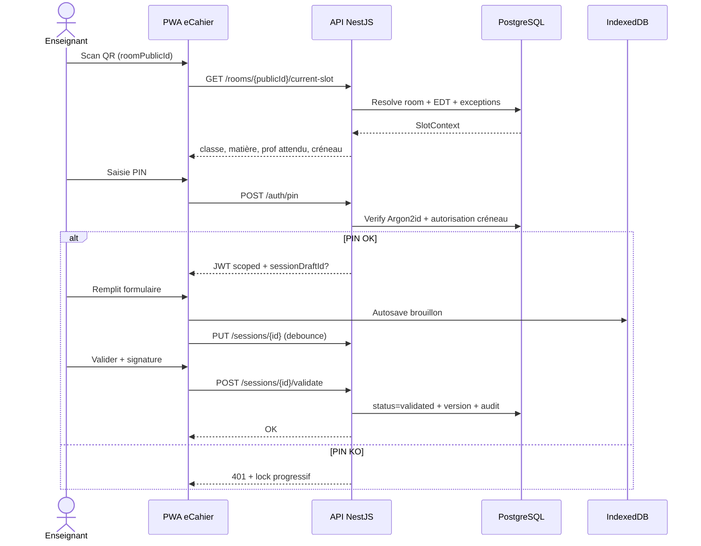
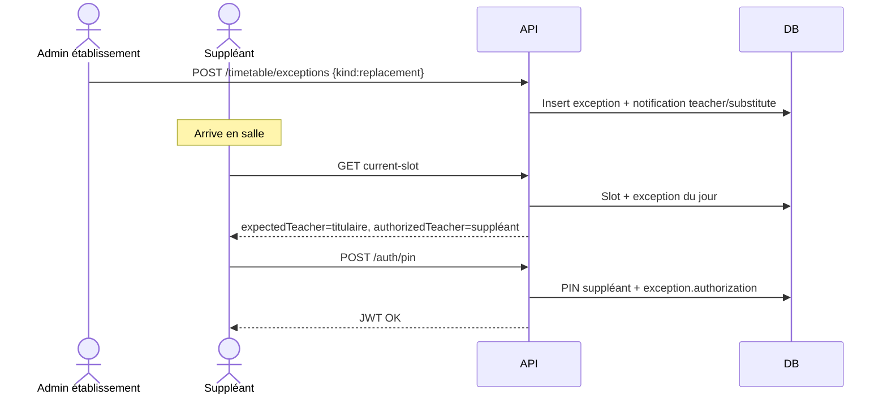
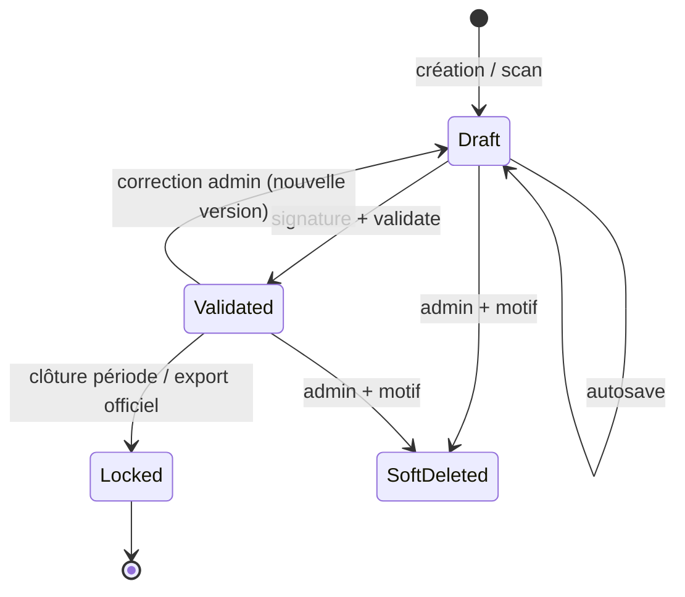
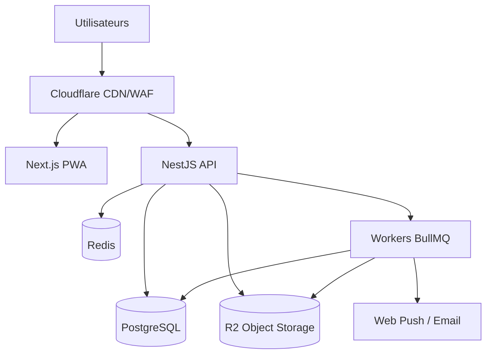

# Diagrammes UML — eCahier

Les diagrammes sont en **Mermaid** (rendus GitHub, Notion, VS Code). Sources de vérité pour l’équipe.

---

## 1. Diagramme de cas d’utilisation

---

## 2. Diagramme de classes (domaine)

---

## 3. Séquence — Scan QR → validation séance

---

## 4. Séquence — Remplacement enseignant

---

## 5. États d’une séance

---

## 6. Déploiement (composants)

---

## 7. Modèle de permissions (RBAC)

| Action | Enseignant | Admin école | Admin national |
|---|---|---|---|
| Scan + PIN + saisie ses séances | Oui | Oui* | Non |
| Lire ses séances / devoirs | Oui | Oui | Non |
| Lire toutes séances école | Non | Oui | Lecture agrégée |
| CRUD enseignants / PIN | Non | Oui | Non |
| CRUD salles / QR / EDT | Non | Oui | Non |
| Exceptions / remplacements | Non | Oui | Non |
| Export PDF/Excel école | Non | Oui | Oui (multi) |
| Gérer établissements | Non | Non | Oui |
| Audit logs | Ses actions | École | National |

\*Un admin peut saisir en mode supervision uniquement si feature flag activé.
