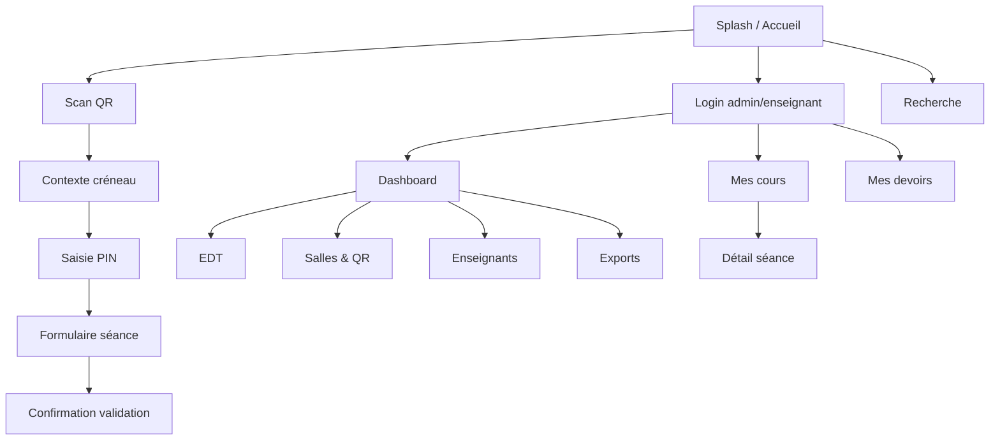

# Wireframes — eCahier

Convention : mobile-first (360×800). Les layouts desktop étendent en 2 colonnes sans changer le parcours.

Légende ASCII :
- `[ ]` champ
- `( )` bouton primaire
- `« »` navigation
- `QR` zone caméra

---

## 1. Carte des écrans



---

## 2. Enseignant — Accueil

```
┌─────────────────────────┐
│ eCahier          [☰]    │
│                         │
│     Cahier de textes    │
│     numérique           │
│                         │
│  ( Scanner la salle )   │
│  [ Me connecter     ]   │
│                         │
│  Statut: En ligne ●     │
└─────────────────────────┘
```

**Règle UX** : un seul CTA dominant = Scanner. Pas de stats sur cet écran.

---

## 3. Scan QR

```
┌─────────────────────────┐
│ « Retour                │
│                         │
│  ┌───────────────────┐  │
│  │                   │  │
│  │    [ caméra QR ]  │  │
│  │                   │  │
│  └───────────────────┘  │
│                         │
│  Placez le QR de la     │
│  salle dans le cadre    │
│                         │
│  [ Saisir le code salle]│
└─────────────────────────┘
```

Fallback manuel si caméra indisponible (saisie `publicId` / code salle).

---

## 4. Contexte créneau + PIN

```
┌─────────────────────────┐
│ Salle B12               │
│ Mardi 28 juil. · 08:00  │
│─────────────────────────│
│ Classe    3ème A        │
│ Matière   Mathématiques │
│ Prévu     M. OBAME      │
│─────────────────────────│
│ Confirmez votre identité│
│                         │
│      [ • • • • • • ]    │
│                         │
│     ( Valider )         │
│                         │
│ Ce n’est pas votre      │
│ créneau ? Contacter     │
│ l’administration        │
└─────────────────────────┘
```

Champs contexte en **lecture seule**. PIN à grands hits targets (≥ 48 px).

---

## 5. Formulaire séance

```
┌─────────────────────────┐
│ « 3ème A · Maths        │
│ Brouillon · Sync OK     │
│─────────────────────────│
│ Titre de la leçon       │
│ [                     ] │
│                         │
│ Contenu du cours        │
│ [                     ] │
│ [                     ] │
│                         │
│ Exercices réalisés      │
│ [                     ] │
│                         │
│ Devoirs donnés          │
│ [                     ] │
│ Remise [ JJ/MM/AAAA ]   │
│                         │
│ Observations            │
│ [                     ] │
│                         │
│ Compétences (optionnel) │
│ [ + Ajouter ]           │
│                         │
│ ( Enregistrer brouillon)│
│ ( Valider la séance )   │
└─────────────────────────┘
```

Desktop : colonne gauche contexte ; droite formulaire.

Validation → modal PIN confirm + résumé.

---

## 6. Historique enseignant

```
┌─────────────────────────┐
│ Mes cours        [🔍]   │
│ [Classe ▾][Matière ▾]   │
│ [Du ] [Au ]             │
│─────────────────────────│
│ 28/07 · 3A · Maths      │
│ Pythagore               │
│─────────────────────────│
│ 27/07 · 3A · Maths      │
│ Fractions               │
│─────────────────────────│
│ Onglets: Cours | Devoirs│
└─────────────────────────┘
```

---

## 7. Dashboard admin établissement

```
┌──────────────────────────────────────────┐
│ eCahier · Lycée Léon Mba    Aujourd’hui  │
│──────────────────────────────────────────│
│  [42] Cours saisis   [7] Non renseignés  │
│  [86%] Progression                       │
│──────────────────────────────────────────│
│ Par enseignant          │ Récents        │
│ Obame    5/6            │ 08:12 Maths 3A │
│ Nzue     4/4            │ …              │
│──────────────────────────────────────────│
│ Nav: Accueil | EDT | Salles | Équipe | … │
└──────────────────────────────────────────┘
```

---

## 8. Gestion salles & QR

```
┌─────────────────────────┐
│ Salles            (+ )  │
│ B12  Actif  [QR] [⋮]    │
│ A03  Actif  [QR] [⋮]    │
│ Lab1 Actif  [QR] [⋮]    │
└─────────────────────────┘
```

Écran détail : aperçu QR, (Imprimer), (Télécharger PDF), (Tourner secret).

---

## 9. EDT + exception

```
┌──────────────────────────────────────────┐
│ Emploi du temps · Semaine 30             │
│ Grille Lun→Sam / salles ou classes       │
│ Clic créneau → panneau latéral           │
│ [Remplacement] [Permutation] [Annuler]   │
└──────────────────────────────────────────┘
```

---

## 10. Recherche

```
┌─────────────────────────┐
│ 🔍 [ Pythagore…… ]      │
│ Cours                   │
│  · Pythagore — 3A       │
│ Devoirs                 │
│  · Exercices p.42       │
│ Enseignants             │
│  · M. Obame             │
└─────────────────────────┘
```

---

## 11. Principes d’interaction

1. **Jamais plus de 2 décisions** avant de pouvoir saisir
2. Gros boutons, contraste WCAG AA
3. Latin clair, phrases courtes, pas de jargon
4. Feedback offline permanent
5. Erreurs PIN en langage simple + countdown lock
6. Pas de cards décoratives sur le hero ; cards seulement pour listes actionnables
